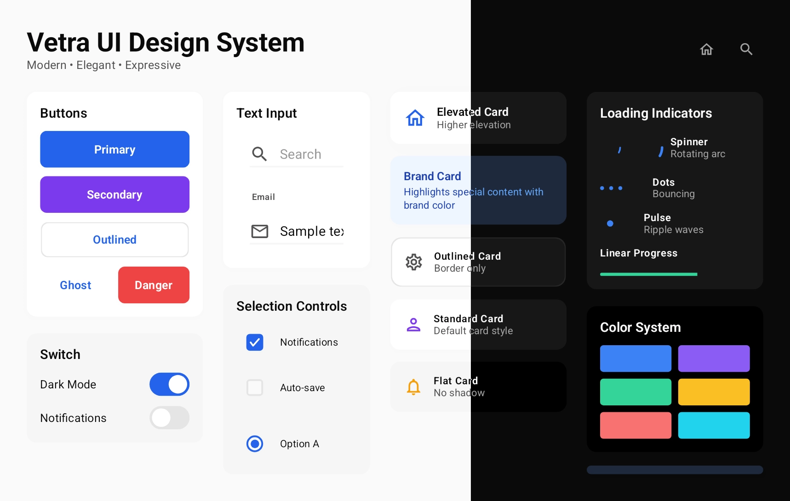

# Vetra UI

<div align="center">


**A Modern, Elegant UI Design System for Compose Multiplatform**

*Building delightful experiences with light, depth, and motion*

[](https://kotlinlang.org)
[](https://www.jetbrains.com/compose-multiplatform/)
[](https://central.sonatype.com/artifact/com.flyfishxu.vetraui/core)
[](https://opensource.org/licenses/MIT )
</div>

<div align="center">
  
</div>

## Features

### Cross-Platform
- Support Android iOS and Desktop

### Dark Mode
- Cross-platform theme management
- Carefully calibrated dark color palette
- Smooth theme transition animations

### Developer Friendly
- API design similar to Material Design for low learning curve
- Clear naming conventions and comprehensive documentation
- Rich Preview examples for every component

### Lightful UI
- Elegance over Flash: No effects for effect's sake—every animation serves a purpose
- Unity over Variety: Consistent design language reduces cognitive load
- Natural over Mechanical: Motion follows physics, interactions follow intuition
- Clarity over Abstraction: Intuitive naming, predictable APIs

## Quick Start

### Installation (Still developing, not yet released)

Add dependency in `libs.versions.toml`:

```toml
[versions]
vetraui = "1.0.0-alpha01"

[libraries]
vetraui-core = { module = "com.flyfishxu.vetraui:core", version.ref = "vetraui" }
```

In your `build.gradle.kts`:

```kotlin
commonMain.dependencies {
    implementation(libs.vetraui.core)
}
```

### Basic Usage

```kotlin
import com.flyfishxu.vetraui.core.theme.VetraTheme
import com.flyfishxu.vetraui.core.components.*

@Composable
fun App() {
    VetraTheme(darkTheme = false) {
        Column(
            modifier = Modifier
                .fillMaxSize()
                .padding(24.dp),
            verticalArrangement = Arrangement.spacedBy(16.dp)
        ) {
            // Button
            VetraButton(onClick = { /* ... */ }) {
                Text("Get Started")
            }
            
            // Card
            VetraCard {
                Text("Beautiful content in a refined container")
            }
            
            // TextField
            VetraTextField(
                value = searchText,
                onValueChange = { searchText = it },
                placeholder = "Search..."
            )
        }
    }
}
```

## Contributing

Contributions are welcome! Before submitting:

- Follow the existing code style
- Add `@Preview` annotations for new components
- Write clear documentation
- Test cross-platform compatibility
- Keep components independent and reusable


## LICENSE

VetraUI is [MIT](https://github.com/flyfishxu/vetra-ui/blob/main/LICENSE) licensed.

---

<div align="center">

[Example App](composeApp/) · [Report Bug](https://github.com/flyfishxu/vetra-ui/issues)

</div>